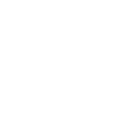

<a href="https://github.com/itdevwu/qloud"></img></a>

<a href="https://docs.itdevwu.com"></img></a>

# What is Qloud?

***Qloud*** is a web platform demonstrating some of the classic quantum algorithms.
It can simulate quantum computer on both quantum and classical hardwares.
[Microsoft Q#](https://learn.microsoft.com/en-us/azure/quantum/overview-what-is-qsharp-and-qdk) is the key to such capabilities.
Qloud can create quantum experiment tasks according to user input from the web side, and then do the simulations/experiments on its Q# backend.

# Features

## Supported Algorithms

Qloud has a support list for quantum algorithm:

- [ ] Shor
- [x] Grover

*An algorithm gets a tick means it has been supported; one without a tick yet still on the list means it's a TODO.*

# Deploy Qloud

TODO.

# Copyright

Copyright 2022-present itdevwu

Licensed under the Apache License, Version 2.0 (the "License");
you may not use this file except in compliance with the License.
You may obtain a copy of the License at

   [http://www.apache.org/licenses/LICENSE-2.0](http://www.apache.org/licenses/LICENSE-2.0)

Unless required by applicable law or agreed to in writing, software
distributed under the License is distributed on an "AS IS" BASIS,
WITHOUT WARRANTIES OR CONDITIONS OF ANY KIND, either express or implied.
See the License for the specific language governing permissions and
limitations under the License.
